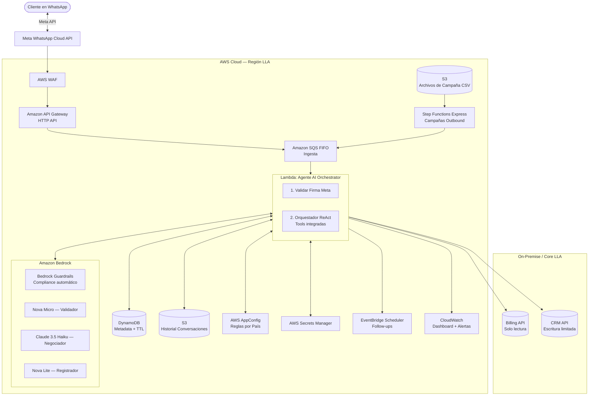

# Proyecto Ágil — Sistema Multi-Agente de Gestión de Clientes

> **Liberty Latin America · AI Developer Technical Assessment · Junio 2026**

[](https://python.org)
[](https://streamlit.io)
[](https://langchain.com)
[](https://ollama.com)
[](tests/)

---

## El Problema de Negocio

Liberty Latin America opera en Panamá con una base masiva de suscriptores de internet de fibra, televisión y telefonía. El equipo de cobranza gestiona clientes morosos principalmente por llamada telefónica y correo electrónico — dos canales que no escalan y que tienen tasas de apertura del 20–30%.

WhatsApp tiene una tasa de apertura superior al **90%** en Panamá. La solución está clara: necesitamos un sistema de Agentes de IA que gestione la recuperación de cartera vencida a través de WhatsApp, de forma empática, escalable y segura.

Este repositorio contiene:
- **El diseño de arquitectura completo** para producción en AWS → [`doc/arquitectura_aws.md`](doc/arquitectura_aws.md)
- **Un prototipo funcional** con agentes reales, tools, flujo conversacional y UI simulando WhatsApp

---

## Arquitectura del Sistema (Producción AWS)



**Decisiones clave:** HTTP API en lugar de REST API (70% más barato). Sin Lambda Authorizer separado — la firma de Meta se valida dentro del Agent Lambda. Sin Tool Lambdas intermedias — el Agent Lambda llama directamente a Billing y CRM APIs con IAM Least Privilege. Modelos distintos por agente (Nova Micro para tareas simples, Haiku para negociación compleja). Bedrock Guardrails reemplaza la segunda invocación LLM del Supervisor. Historial en S3 (sin límite 400KB) con metadata en DynamoDB. Ver justificación completa en [`doc/arquitectura_aws.md`](doc/arquitectura_aws.md).

---

## Arquitectura del Prototipo (Local)

El prototipo implementa una arquitectura **Multi-Agente** con cuatro agentes especializados y un Supervisor de Cumplimiento:

```
[Disparar Campaña / Mensaje Entrante]
          │
          ▼
 ┌─────────────────────────────────────────┐
 │            ORQUESTADOR                  │
 │  ┌──────────────────────────────────┐   │
 │  │  Agente 1: Validador de Identidad│   │  ← Confirma que hablas con el titular
 │  └──────────────────┬───────────────┘   │
 │                     │ [FASE:NEGOCIAR]   │
 │  ┌──────────────────▼───────────────┐   │
 │  │  Agente 2: Negociador            │   │  ← Ofrece pago total → cuotas → promesa
 │  └──────────────────┬───────────────┘   │
 │           Tools disponibles:            │
 │     · consultar_datos_cliente           │
 │     · generar_link_pago                 │
 │     · registrar_pago_inmediato          │
 │     · escalar_a_humano                  │
 │                     │ [FASE:REGISTRAR]  │
 │  ┌──────────────────▼───────────────┐   │
 │  │  Agente 3: Registrador           │   │  ← Formaliza el acuerdo en CRM
 │  └──────────────────┬───────────────┘   │
 │           Tools disponibles:            │
 │     · registrar_promesa_pago            │
 │                     │ [FASE:CERRAR]    │
 │  ┌──────────────────▼───────────────┐   │
 │  │  Agente 4: Cierre                │   │  ← Confirma y celebra
 │  └──────────────────────────────────┘   │
 └─────────────────────────────────────────┘
          │ (toda respuesta pasa por aquí)
          ▼
 ┌─────────────────────┐
 │  Supervisor LLM     │  ← Audita cumplimiento antes de enviar al cliente
 └──────────┬──────────┘
            │
     APROBADO → mensaje enviado
     RECHAZADO → mensaje seguro por defecto
```

El patrón de fases evita que un solo LLM monolítico mezcle responsabilidades. El Supervisor actúa como guardrail de cumplimiento: ningún mensaje llega al cliente sin pasar por él.

---

## Las 6 Preguntas del Assessment — Respuestas Rápidas

| Pregunta | Respuesta resumida | Detalle |
|---|---|---|
| ¿Cómo sabe el agente con quién hablar? | **Inbound**: el cliente escribe → se consulta DynamoDB + BillingDB. **Outbound**: campaña batch via EventBridge + Step Functions con CSV en S3 | [§2 Estrategia](doc/arquitectura_aws.md#2-estrategia-y-reglas-de-negocio) |
| ¿Cómo funciona internamente? | Patrón **ReAct** (Reason & Act): razona con Bedrock, ejecuta Tools (Lambdas), formula respuesta empática. 4 agentes especializados + Supervisor | [§2 Funcionamiento](doc/arquitectura_aws.md#cómo-funciona-el-agente-internamente) |
| ¿Cómo se integra con sistemas existentes? | **Tool Lambdas** con roles IAM de mínimo privilegio: `ToolBillingLambda` (read-only) y `ToolCRMLambda` (write limitado) | [§2 Integración](doc/arquitectura_aws.md#cómo-se-integra-con-los-sistemas-existentes) |
| ¿Cómo se gestiona y controla? | Reglas de negocio por país en **AWS AppConfig** (sin redesplegar código). Campañas via CSV en S3 | [§2 Gestión](doc/arquitectura_aws.md#cómo-se-gestiona-y-controla-el-sistema) |
| ¿Qué puede salir mal? | Alucinaciones → guardrails + Tool valida límites. Saturación humanos → límite dinámico en AppConfig. Ataques → WAF + rate limit en DynamoDB | [§3 Riesgos](doc/arquitectura_aws.md#3-riesgos-mitigaciones-y-métricas) |
| ¿Cómo sabemos si funciona? | KPIs: Tasa de Recuperación ($), FCR, % Escalamiento. Técnicos: latencia p95 < 5s, error rate Lambda/Bedrock | [§3 Métricas](doc/arquitectura_aws.md#cómo-sabemos-si-el-sistema-está-funcionando-métricas) |

---

## Supuestos Declarados

El assessment exige declarar supuestos explícitamente. Estos son los que se tomaron:

| Supuesto | Justificación |
|---|---|
| LLA tiene una API interna de billing con endpoint REST | Estándar en empresas telco medianas. Si fuera batch/file, el patrón de integración sería S3 + Glue |
| El CRM soporta escritura vía API (REST o SDK) | Requerido para registrar promesas sin intervención manual |
| Meta Business API está habilitada para el número de LLA | Prerequisito no técnico — requiere aprobación de Meta |
| El volumen de morosos activos es < 100,000 simultáneos | SQS + Lambda maneja este volumen. Para >1M habría que evaluar Amazon Kinesis |
| Las regulaciones de Panamá permiten contacto por WhatsApp con clientes existentes | Se asume consentimiento previo en el contrato de servicio. Para clientes nuevos se requiere opt-in explícito |
| El modelo de IA (Bedrock) tiene latencia < 3s por invocación | Deja margen para lograr latencia p95 < 5s total incluyendo tools |

---

## Perfiles de Cliente Mock

El prototipo incluye 5 perfiles diseñados para cubrir los casos de prueba más representativos:

| Teléfono | Cliente | Deuda | Días vencido | Segmento | Perfil de prueba |
|---|---|---|---|---|---|
| +50712345678 | Juan Pérez | $150.00 | 45 días | MEDIO | ✅ Caso Feliz — acepta pagar |
| +50787654321 | María Gómez | $45.50 | 15 días | BAJO | 😤 Caso Enojado — escala a humano |
| +50755555555 | Carlos Rodríguez | $800.00 | 90 días | ALTO | 🧩 Caso Complejo — pide condonación |
| +50799999999 | Ana Sánchez | $25.00 | 5 días | BAJO | ⚡ Caso Rápido — pago inmediato |
| +50766666666 | Roberto Castillo | $320.00 | 62 días | ALTO | ⚠️ Alto Riesgo — últimas cuotas |

---

## Instalación y Ejecución

### Prerrequisitos

- Python 3.10+
- [Ollama](https://ollama.com) — para correr Llama 3.1 localmente (sin API Keys de pago)

### 1. Instalar Ollama y el modelo

**macOS / Linux:**
```bash
brew install ollama
ollama serve &
ollama pull llama3.1   # ~4.7 GB, solo la primera vez
```

**Windows:**
1. Descarga el instalador desde [ollama.com/download/windows](https://ollama.com/download/windows)
2. Abre PowerShell y ejecuta:
```powershell
ollama pull llama3.1
```

### 2. Instalar dependencias

**macOS / Linux:**
```bash
python3 -m venv estebantest
source estebantest/bin/activate
pip install -r requirements.txt
```

**Windows:**
```powershell
python -m venv estebantest
estebantest\Scripts\activate
pip install -r requirements.txt
```

### 3. Ejecutar el simulador

> [!IMPORTANT]
> Ollama debe estar corriendo antes de lanzar la app. Si ves `[Errno 61] Connection refused` en los logs, ábrelo en una terminal separada:
> ```bash
> ollama serve
> ```

```bash
streamlit run app.py
```

Esto abre automáticamente `http://localhost:8501` en tu navegador.

---

## ¿Cómo hacer la demo?

1. En la **barra lateral izquierda**, selecciona un cliente del menú desplegable
2. Verás la tarjeta del cliente con su deuda y perfil de riesgo
3. Presiona **"▶ Iniciar conversación"** — el agente envía el primer mensaje
4. Interactúa como si fueras el cliente
5. Escribe **STOP** en cualquier momento para simular un opt-out

### Flujos recomendados para la demo

| Flujo | Cliente | Cómo probarlo |
|---|---|---|
| **Pago inmediato** | Ana Sánchez | Responde "Sí" → "Voy a pagar ahora" |
| **Plan de cuotas** | Juan Pérez | Responde "Sí" → "No puedo pagar todo" → acepta cuotas |
| **Escalamiento** | María Gómez | Responde con insultos o rechazo rotundo |
| **Supervisor en acción** | Carlos Rodríguez | Pide que le condonen la deuda — observa en los logs cómo el Supervisor intercepta |
| **No es el titular** | Cualquiera | Responde "No, soy su hijo/a" |

> En la terminal donde corre Streamlit puedes ver los **logs del Supervisor** auditando cada respuesta en tiempo real.

---

## Correr los Tests

Los tests validan las Tools de forma aislada — **no requieren que Ollama esté corriendo**.

```bash
pytest tests/ -v
```

Resultado esperado: **14 tests passing** ✅

Los tests cubren:
- `consultar_datos_cliente` — 9 casos incluyendo clientes existentes, inexistentes y todos los mocks
- `generar_link_pago` — 4 casos validando URL, monto y token
- `registrar_pago_inmediato` — 2 casos de confirmación
- `registrar_promesa_pago` — 3 casos incluyendo recordatorio
- `escalar_a_humano` — 2 casos de escalamiento
- Gestión de fases — 7 casos de detección y limpieza de marcas de transición
- Configuración del sistema — 3 casos de integridad del TOOL_MAP y constantes

---

## Estructura del Proyecto

```
llaTechAssesment/
├── app.py                      # Interfaz Streamlit (simulador WhatsApp)
├── multi_agent.py              # Orquestador Multi-Agente + Tools
├── prompts.py                  # System prompts de los 4 agentes + Supervisor
├── mock_data.json              # Base de datos mock (5 perfiles de cliente)
├── requirements.txt            # Dependencias Python
├── tests/
│   └── test_agents.py          # 14 tests unitarios con pytest
├── doc/
│   ├── arquitectura_aws.md     # Diseño de arquitectura AWS + estrategia completa
│   ├── plan_trabajo_lla.md     # Hoja de ruta del assessment
│   └── test_flows.md           # Flujos de prueba detallados
└── README.md                   # Este archivo
```

---

## Variables de Entorno

| Variable | Default | Descripción |
|---|---|---|
| `OLLAMA_MODEL` | `llama3.1` | Modelo Ollama a usar (ej. `llama3.2`, `mistral`) |

```bash
OLLAMA_MODEL=llama3.2 streamlit run app.py
```

---

## Decisiones de Diseño Clave

**¿Por qué Ollama + Llama 3.1 en el prototipo si la arquitectura propone Bedrock?**
El assessment permite usar cualquier herramienta local para el prototipo. Ollama elimina la necesidad de API Keys de pago y permite que el evaluador corra la demo sin configuración adicional. En producción, el mismo código de orquestación funciona apuntando a Bedrock — solo cambia el `llm = ChatOllama(...)` por `llm = ChatBedrock(...)`.

**¿Por qué 4 agentes especializados en lugar de uno monolítico?**
Cada agente tiene un único objetivo (Single Responsibility). El Validador no sabe de deudas, el Negociador no registra en el CRM, el Registrador no negocia. Esto hace que los prompts sean más cortos, precisos y fáciles de auditar. Además, cada agente solo tiene acceso a las tools que necesita — principio de mínimo privilegio aplicado al nivel del LLM.

**¿Por qué un Supervisor como agente separado?**
El Supervisor es el guardrail de cumplimiento. Si el Negociador alucina y promete condonar el 100% de la deuda, el Supervisor lo intercepta antes de que el mensaje llegue al cliente. Es la segunda línea de defensa después de los guardrails del prompt.

---

## Arquitectura AWS Completa

El documento de arquitectura responde todas las preguntas del comité técnico y comercial:

→ **[Ver arquitectura completa en `doc/arquitectura_aws.md`](doc/arquitectura_aws.md)**

Incluye:
- Supuestos de diseño declarados explícitamente
- Diagrama de componentes AWS con justificación de cada servicio seleccionado
- Estrategia Inbound y Outbound
- Mecanismo de re-acercamiento inteligente (follow-ups automáticos con EventBridge)
- Integración con sistemas existentes con IAM Least Privilege
- Gestión de campañas y reglas de negocio por país con AppConfig
- Análisis de riesgos y mitigaciones
- KPIs de negocio y métricas técnicas con metas concretas
- **Estimación de costos**: ~$0.002 USD por conversación completa a escala
