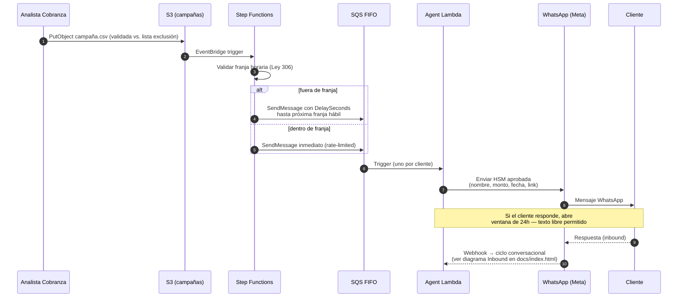

# Diseño Técnico — Sistema Multi-Agente de Cobranza

**Candidato**: Esteban (AI Developer)  
**Fecha**: Junio 2026  
**Documento ejecutivo**: [`docs/index.html`](../docs/index.html)

Este documento es la referencia técnica de implementación. La narrativa de negocio, métricas visuales, flujos de escalamiento y visión futura se encuentran en `docs/index.html`.

---

## 0. Supuestos Declarados

Los supuestos están agrupados por dominio. Los marcados como **🚩 riesgo alto** son los que más impacto tendrían si no se cumplen — se validan antes del kickoff técnico.

### 0.1 Integración con sistemas existentes

| Supuesto | Impacto si no se cumple | Plan alternativo |
|---|---|---|
| Billing expone API REST/gRPC accesible desde VPC, con campos `saldo_vencido`, `dias_vencido`, `fecha_vencimiento` | Sin saldo en tiempo real, la conversación pierde precisión | Integración batch vía S3 + Glue; saldo con latencia de 24h (degrada experiencia pero mantiene el caso de uso) |
| CRM soporta escritura vía API REST/SDK a endpoints específicos (`promesas`, `tickets_escalamiento`) | No se pueden registrar acuerdos automáticamente | Cola SQS + worker batch que escribe en lote vía SFTP/archivo |
| LLA dispone de un área de riesgo (o equivalente) que clasifica clientes en BAJO/MEDIO/ALTO y expone el campo vía API | El agente aplica la fórmula interna como fallback | Usar fallback (días de mora + monto + promesas incumplidas) hasta que el área provea el dato |
| Historial de promesas incumplidas existe en el CRM | El perfil de riesgo arranca con 2 señales en lugar de 3 | Primera campaña usa solo días de mora y monto; perfil se enriquece con cada interacción |
| **🚩 Existe un gateway de pago (Worldpay, Stripe, gateway local) ya integrado al portal de LLA, con capacidad de generar links de pago únicos por cliente** | Sin gateway, el agente solo puede registrar promesas — no procesar pagos | El flujo "pago inmediato" se reemplaza por "redirección al portal/sucursal"; el agente sigue siendo útil pero pierde ~30% de la conversión esperada |
| **🚩 El número WhatsApp en el CRM coincide con el número activo del titular** | Conversaciones con personas que ya no son el cliente; riesgo legal | El Validador (Agente 1) confirma identidad antes de revelar cualquier dato de cuenta — si rechaza, la sesión termina sin exposición de PII |

### 0.2 Canal WhatsApp / Meta

| Supuesto | Impacto si no se cumple | Plan alternativo |
|---|---|---|
| Meta Business API está habilitada para el número LLA y la cuenta tiene tier **Tier 2 o superior** (≥10K conversaciones únicas/24h) | Rate limit insuficiente para campañas masivas | Solicitar upgrade a Meta (semanas); fragmentar campañas en lotes diarios mientras tanto |
| LLA cuenta con templates HSM pre-aprobadas por Meta para el primer mensaje outbound de cobranza (ver §1.2) | No se puede iniciar contacto outbound — Meta rechaza | Proceso no técnico — diseño y aprobación de templates con Meta (1–3 semanas) |
| Calidad del número WhatsApp se mantiene en estado verde (low block rate) | Meta degrada el tier y limita el envío | Monitorear `phone_number_quality` vía Meta API; pausar campañas si baja a amarillo |

### 0.3 Operación y negocio

| Supuesto | Impacto si no se cumple | Plan alternativo |
|---|---|---|
| **Todos los clientes cargados en una campaña son aptos para ser contactados** (la elegibilidad — opt-out, lista negra, restricción legal — se valida en el proceso que genera el CSV, **antes** de que el agente exista) | El agente contactaría clientes excluidos, generando infracción regulatoria | El pipeline de generación de campañas hace cross-check contra la tabla `excluidos_canal` antes de escribir el CSV en S3. El agente asume elegibilidad — no la re-valida |
| **🚩 Existe un equipo de asesores humanos disponible durante toda la franja horaria permitida (L–V 8–18h, Sáb 8–15h) para atender escalamientos** | Los casos escalados quedan en cola sin atención; la promesa "te contactará un asesor" se rompe | Definir SLA de atención por horario (turnos rotativos) o limitar la operación del agente a la franja en que el equipo está disponible |
| El consentimiento de contacto por WhatsApp está cubierto en el contrato de servicio vigente — **pendiente de validación con el área legal de LLA antes del go-live** | Riesgo legal de contactar sin opt-in | Campaña de opt-in previa (SMS o email transaccional) + 2–3 semanas adicionales de timeline |
| Idioma único: español neutro con modismos panameños permitidos | Clientes anglo en Panamá (~5% del mercado corporativo) reciben mensajes en español | Detección de idioma en turno 1 + segundo conjunto de prompts en inglés. Fuera de scope del MVP |

### 0.4 Capacidad técnica

| Supuesto | Impacto si no se cumple | Plan alternativo |
|---|---|---|
| Volumen pico (fin de mes) ≤ 5× el volumen promedio diario; volumen promedio ≤ 100K conversaciones/mes | SQS FIFO a 300 TPS por grupo es suficiente | Provisioned Concurrency en Lambda durante picos; migrar a Kinesis Data Streams si >1M simultáneos |
| Latencia Bedrock (Claude 3.5 Haiku, us-east-1) p95 < 3s por invocación | El SLA end-to-end p95 < 5s no se cumple | Circuit breaker con mensaje de "estoy procesando tu solicitud" + respuesta asíncrona; considerar `claude-haiku-4-5` si la mejora de latencia justifica el costo |

**Nota sobre bases de datos de LLA:** Este diseño no asume tecnología específica (PostgreSQL, Oracle, Cassandra, etc.) para los sistemas core. La integración es siempre vía API — la tecnología subyacente del sistema de facturación o CRM es irrelevante mientras la API sea accesible desde la VPC.

---

## 1. Arquitectura AWS

### 1.0 Restricciones del canal WhatsApp (Meta) — críticas para el diseño

Antes de hablar de servicios AWS, hay tres restricciones de Meta que condicionan toda la arquitectura. Ignorarlas hace que el sistema "funcione en demo" pero falle el día del lanzamiento.

**a) Templates HSM (Highly Structured Messages) — obligatorias para outbound**

Meta solo permite iniciar conversaciones outbound usando una plantilla pre-aprobada. El primer mensaje de cobranza **no puede ser texto libre generado por LLM**. La plantilla se aprueba con Meta una vez por categoría (`UTILITY` para cobranza) y se referencia por nombre.

Implicación de diseño:
- El paso ⑤ del flujo outbound (primer contacto) usa una HSM, no Bedrock. El LLM entra recién cuando el cliente responde.
- Mantenemos un catálogo de 3–5 HSMs por segmento de riesgo (BAJO/MEDIO/ALTO), versionadas en S3.
- Variables permitidas: nombre, monto, fecha vencimiento, link de pago. **No se puede personalizar el cuerpo del mensaje fuera de las variables aprobadas.**

Ejemplo de HSM aprobada (categoría UTILITY):
```
Hola {{1}}, te saludamos de Liberty Latin America. Tenés un saldo de
${{2}} con vencimiento al {{3}}. Podés regularizarlo en {{4}} o
responder a este mensaje para conocer opciones de pago. 🙏
```

**b) Ventana de servicio de 24 horas**

Tras el último mensaje del cliente, Meta abre una ventana de 24h en la que se puede responder con texto libre (cualquier cosa que el LLM genere). Pasada la ventana, **solo se permite enviar HSMs nuevamente** — y solo de categoría aprobada.

Implicación de diseño:
- `DynamoDB.Session.LastInboundTime` se compara contra `now()` en cada turno.
- Si la ventana expiró y el agente necesita re-engagement (ej: follow-up de promesa de pago), se envía una HSM categorizada (`MARKETING` u `UTILITY` según el caso) — no texto libre.
- EventBridge Scheduler agenda follow-ups dentro de la ventana de 24h cuando es posible para minimizar costo (las HSMs cuestan más que mensajes de sesión).

**c) Calidad del número y rate limits por tier**

Meta clasifica los números WhatsApp Business en tiers según calidad y volumen probado:
- **Tier 1**: 1K conversaciones únicas / 24h
- **Tier 2**: 10K / 24h
- **Tier 3**: 100K / 24h
- **Tier 4**: ilimitado

Si el `block_rate` o el `report_rate` sube, Meta degrada el tier. Si baja a estado **rojo** (`flagged`), suspende el envío. Para una operación masiva LLA necesita Tier 3 o 4, y debe mantener la calidad del número en verde — lo cual depende directamente de **cuán bien recibido sea el agente**. Las métricas de bloqueo del agente son un KPI técnico, no solo de UX.

Implicación de diseño:
- CloudWatch métrica custom `lla.whatsapp.quality_rating` con alarma si baja de `GREEN`.
- Si entra en `YELLOW`, Step Functions pausa nuevas campañas automáticamente y notifica al supervisor.
- El supervisor revisa las últimas 50 conversaciones para identificar la causa raíz antes de reanudar.

### 1.1 Componentes y justificación

#### Ingesta

**API Gateway HTTP API** (no REST API)  
WhatsApp exige HTTP 200 en <5 segundos o reintenta. HTTP API cubre este caso y cuesta 70% menos que REST API ($1.00 vs $3.50/millón requests). Las características avanzadas de REST API (caching, usage plans) no se necesitan para un webhook receiver.

**Amazon SQS FIFO**  
Desacopla recepción de procesamiento. El 200 va a Meta en milisegundos; el LLM toma 2–5 segundos. FIFO garantiza orden por cliente (`MessageGroupId = NumeroTelefono`), evitando race conditions cuando el cliente envía dos mensajes en sucesión rápida. Capacidad: 300 TPS.

**Sin Lambda Authorizer separado**  
La firma Meta (`x-hub-signature-256`) se valida dentro del Agent Lambda tras leer de SQS. Elimina un hop de red y un cold start adicional en el path crítico. Si la firma es inválida, el mensaje se descarta silenciosamente — Meta ya recibió su 200.

#### Procesamiento

**AWS Lambda — ¿Punto único de falla?**  
No. Lambda tiene alta disponibilidad nativa: múltiples zonas de disponibilidad, escalado horizontal a miles de instancias, SLA de 99.95%. Los riesgos reales son:
- **Bug en código** → mitigado con DLQ que captura fallos para análisis y reproceso
- **Timeout** → Circuit breaker envía mensaje de fallback al cliente antes de expirar
- **Cold start** → Provisioned Concurrency configurable durante horas de campaña

Cada invocación procesa exactamente un turno (no toda la sesión), manteniéndose dentro del límite de 15 minutos de Lambda.

**Sin Tool Lambdas intermedias**  
El Agent Lambda llama directamente a Billing y CRM APIs con IAM Least Privilege. Elimina 200–500ms de latencia y un cold start adicional por herramienta invocada. Solo aplica si las APIs son accesibles desde la VPC (ver supuesto).

#### Modelos de IA — Selección por tarea

| Agente | Tarea | Modelo | Razón técnica | Costo relativo |
|---|---|---|---|---|
| Validador | Clasificación binaria (sí/no/no soy titular) | Amazon Nova Micro | Tarea simple; LLM de gran tamaño es overkill | ~$0.035/M tokens |
| Negociador | Razonamiento multi-paso, detección de tono, persuasión, cálculo de fechas | Claude 3.5 Haiku | Mayor capacidad de razonamiento de la familia. Detecta hostilidad y evasión con contexto | ~$0.80/M tokens |
| Registrador | Extracción de entidades estructuradas (monto, fecha) de historial corto | Amazon Nova Lite | Supera a Micro en extracción con contexto; 5× más barato que Haiku | ~$0.06/M tokens |
| Cierre | Texto formulaico de confirmación | Amazon Nova Lite | No requiere creatividad; texto basado en plantilla | ~$0.06/M tokens |
| Supervisor | Filtrado de compliance | Bedrock Guardrails | No es LLM call — filtro nativo integrado en la invocación. 100× más barato | ~$0.15/1000 unidades |

**Modelos descartados:**
- GPT-4o Mini: capacidad similar a Haiku pero requiere salir de AWS (privacidad de datos, latencia de red, vendor adicional)
- Claude 3.5 Sonnet para todos los agentes: 3× más caro que Haiku con mejora marginal para tareas de cobranza estructuradas
- Reglas deterministas sin LLM para el Validador: descartado porque el lenguaje natural de confirmación de identidad es demasiado variado

#### Estado y Memoria

**DynamoDB — Metadata de sesión**  
Estado de la sesión: teléfono, fase actual, timestamp, clave S3 del historial, perfil de riesgo calculado. TTL de 48h para auto-expirar sesiones cerradas. Partition key: `COUNTRY_ID#PHONE_NUMBER` para escalabilidad multi-país.

**S3 — Historial de conversaciones**  
DynamoDB tiene límite de 400KB/item. Una conversación de 35 turnos con tool calls puede superar ese límite. S3 no tiene límite, cuesta 3× menos por GB, y permite análisis con Athena. Lifecycle Policy: 90 días en S3 Standard (hot), luego S3 Glacier para auditoría regulatoria.

Key structure: `conversations/{COUNTRY}/{PHONE}/{DATE}.json`

#### Campaña Outbound

**Step Functions Express — ¿Por qué?**  
Las campañas outbound pueden tener 100,000 clientes. Step Functions Express orquesta el envío con rate limiting (respetar límites de Meta API), reintentos configurables y manejo de errores. Express Workflows cuestan $1.00/millón de transiciones — 40× más barato que Standard, diseñado para alta frecuencia y corta duración.

**EventBridge Scheduler — Follow-ups**  
Cuando el agente espera respuesta, programa un evento para X horas. Al dispararse, una Lambda verifica `LastInteractionTime` en DynamoDB. Si el cliente no respondió, reactiva el agente con historial completo e instrucción de re-acercamiento contextual. Costo: $1.00/millón invocaciones.

#### WAF — ¿Es necesario?

Sí. Un script malicioso enviando 10,000 mensajes genera ~$20 en Bedrock sin WAF. Con WAF: $0.01/millón de requests inspeccionados. ROI positivo ante el primer ataque. Configura rate limiting por IP y por número de teléfono (segunda capa en DynamoDB).

---

## 2. Selección de Modelos de Agentes

### Perfil de riesgo del cliente

**Supuesto declarado:** Se asume que LLA dispone de un área de riesgo (o equivalente en la operación de cobranza) que ya clasifica a los clientes en segmentos BAJO / MEDIO / ALTO. El agente consume ese perfil como dato de entrada al inicio de la sesión — no lo calcula ni lo reemplaza.

La siguiente fórmula es **ilustrativa** de la lógica que ese proceso debería aplicar, y sirve como fallback si el dato no está disponible en la API:

```python
def calcular_perfil_riesgo_fallback(billing_data: dict, crm_data: dict) -> str:
    dias_mora = billing_data["dias_vencido"]
    monto = billing_data["saldo_vencido"]
    promesas_incumplidas = crm_data.get("promesas_incumplidas", 0)

    if dias_mora <= 15 and monto < 50 and promesas_incumplidas == 0:
        return "BAJO"
    elif dias_mora <= 60 and monto <= 200 and promesas_incumplidas <= 1:
        return "MEDIO"
    else:
        return "ALTO"
```

El campo de perfil en la API puede retornar directamente `"BAJO"`, `"MEDIO"` o `"ALTO"` — el agente lo consume sin recalcular. Si el campo viene vacío, se aplica el fallback anterior.

**Actualización dinámica durante la sesión:** El Negociador detecta señales en la respuesta del cliente (hostilidad, evasión, cooperación) y las registra en CRM al finalizar la sesión para enriquecer el perfil en futuras interacciones. Esta información enriquece al área de riesgo, no reemplaza su criterio.

---

## 3. Flujo de Escalamiento

### Árbol de decisión del Negociador

```
Inicio de negociación
│
├── ① Ofrecer pago total
│   ├── Acepta → generar_link_pago() → Registrador → Cierre
│   └── Rechaza → continuar
│
├── ② Ofrecer plan 2 cuotas
│   ├── Acepta → registrar_promesa_pago() → Cierre
│   └── Rechaza → continuar
│
├── ③ Ofrecer plan 3 cuotas (si perfil MEDIO o ALTO)
│   ├── Acepta → registrar_promesa_pago() → Cierre
│   └── Rechaza → continuar
│
├── ④ Proponer promesa de pago con fecha libre
│   ├── Acepta fecha → registrar y agendar follow-up
│   └── Evade o no se compromete → continuar
│
├── ⑤ Ofrecer canal alternativo (portal web, sucursal)
│   ├── Acepta → cierre con follow-up
│   └── Continúa evadiendo → escalar
│
└── ⑥ escalar_a_humano(motivo="sin_acuerdo")
    └── Entrega historial completo al asesor
```

### Escalamientos inmediatos (sin árbol)

| Trigger | Acción | Actualiza perfil CRM |
|---|---|---|
| Lenguaje hostil o insultos | `escalar_a_humano(motivo="cliente_agresivo")` | Sí — flag `contacto_hostil: true` |
| "Quiero hablar con una persona / agente / ejecutivo" | `escalar_a_humano(motivo="solicitud_cliente")` | No |
| Dispute de deuda ("yo ya pagué") | `escalar_a_humano(motivo="disputa_facturacion")` | Sí — flag `disputa_pendiente: true` |
| Turno 30 sin acuerdo | Ofrecer proactivamente canal humano | No |
| Turno 35 (límite) sin acuerdo | `escalar_a_humano(motivo="limite_sesion")` | Sí — flag `sesion_agotada: true` |

**Sobre el límite de 35 turnos:** El límite por defecto es 35 (ajustado para el cliente latinoamericano que tiende a la evasión y el diálogo extenso). Es configurable en AppConfig sin redesplegar código. En el turno 30, el agente ofrece proactivamente el canal humano. Si el cliente prefiere continuar y hay progreso activo en la conversación, un operador puede extender el límite desde AppConfig en tiempo real.

### Franjas horarias de contacto — Ley 306 de 2026 (Panamá)

La **Ley 306, aprobada el 18 de marzo de 2026** por la Asamblea Nacional de Panamá con 41 votos a favor, establece restricciones explícitas para el contacto de cobranza extrajudicial. Es ley vigente, no un supuesto de diseño.

| Día | Franja permitida |
|---|---|
| Lunes – Viernes | 8:00 AM – 6:00 PM |
| Sábado | 8:00 AM – 3:00 PM |
| Domingo | Prohibido |
| Festivos y duelo nacional | Prohibido |

**Regla adicional:** Una vez establecida comunicación efectiva con el deudor en un día, no se puede volver a contactar ese mismo día por ningún otro canal (incluyendo WhatsApp después de una llamada, o viceversa).

**Fuente:** Infobae Panamá, La Estrella de Panamá, Panamá América — marzo 2026. Organismo sancionador: ACODECO.

#### Implementación técnica del bloqueo horario

```python
import pytz
from datetime import datetime

ZONA_HORARIA = pytz.timezone("America/Panama")

FRANJAS_PERMITIDAS = {
    0: ("08:00", "18:00"),  # Lunes
    1: ("08:00", "18:00"),  # Martes
    2: ("08:00", "18:00"),  # Miércoles
    3: ("08:00", "18:00"),  # Jueves
    4: ("08:00", "18:00"),  # Viernes
    5: ("08:00", "15:00"),  # Sábado
    # 6 = Domingo: no existe en el dict → bloqueado
}

def es_horario_permitido(festivos: set) -> bool:
    ahora = datetime.now(ZONA_HORARIA)
    if ahora.date() in festivos:
        return False
    franja = FRANJAS_PERMITIDAS.get(ahora.weekday())
    if not franja:
        return False
    inicio = datetime.strptime(franja[0], "%H:%M").time()
    fin    = datetime.strptime(franja[1], "%H:%M").time()
    return inicio <= ahora.time() <= fin
```

La lista de festivos se gestiona en **AppConfig** (`festivos_panama`) — el equipo comercial la actualiza sin tocar código.

#### Lógica de encolamiento en Step Functions

Cuando se carga un CSV de campaña fuera de la franja permitida (ej. proceso batch a las 3:00 AM), Step Functions no envía los mensajes inmediatamente. En cambio:

1. Escribe los registros en SQS con un `DelaySeconds` calculado hasta el inicio del siguiente período hábil
2. Si el día siguiente es festivo, el delay se extiende al siguiente día hábil disponible
3. El cliente recibe el mensaje a las 8:00 AM del primer día hábil — nunca en madrugada

```python
def calcular_delay_segundos(festivos: set) -> int:
    ahora = datetime.now(ZONA_HORARIA)
    if es_horario_permitido(festivos):
        return 0  # enviar ahora
    # Buscar próximo inicio de franja hábil
    candidato = ahora.replace(hour=8, minute=0, second=0, microsecond=0)
    if ahora.time() >= datetime.strptime("18:00", "%H:%M").time():
        candidato += timedelta(days=1)
    while True:
        if candidato.date() not in festivos and candidato.weekday() in FRANJAS_PERMITIDAS:
            break
        candidato += timedelta(days=1)
        candidato = candidato.replace(hour=8, minute=0, second=0)
    return int((candidato - ahora).total_seconds())
```

SQS soporta un delay máximo de 15 minutos por mensaje. Para delays mayores (fin de semana largo), se usa **EventBridge Scheduler** con la fecha exacta de envío calculada en Step Functions.

### Gestión de opt-out en español

**Importante — límite de intentos de persuasión:**
El agente realiza hasta 3 intentos de negociación (pago total → plan de cuotas → promesa con fecha) antes de aceptar un rechazo como definitivo. Un "no me interesa" en el primer turno no cancela la sesión de inmediato — el agente puede intentar abordar la objeción con empatía una o dos veces más. Después del tercer intento sin acuerdo, activa el flujo de cierre o escala.

**Rechazo sostenido** (después de 2–3 intentos sin acuerdo):
- NO ME INTERESA, NO QUIERO, NO PUEDO, NO TENGO DINERO, BASTA

El agente no insiste más allá del tercer rechazo explícito. Cierra la sesión o programa follow-up según el perfil.

**Opt-out explícito de campaña** (respetado de inmediato — sin intentos adicionales):
- STOP, ALTO, PARA, NO ME CONTACTES

Estas palabras activan cierre inmediato sin intentar persuadir. El estado se registra en DynamoDB con TTL de 30 días. El proceso de campaña los excluirá de futuros envíos durante ese período.

**Solicitud de gestión de lista de contacto** (el agente no actúa — escala al proceso de negocio):
- NUNCA MÁS, ELIMÍNAME, NO ME CONTACTES MÁS, QUÍTENME DE SU LISTA

El agente **no tiene capacidad ni autorización para modificar listas de bloqueo**. Ante estas expresiones, registra la solicitud en CRM con motivo `"solicitud_exclusion_canal"` y cierra la sesión indicando al cliente que su solicitud será procesada por el área correspondiente. La inclusión en lista de exclusión permanente es responsabilidad del área de gestión de clientes de LLA, no del agente.

**No disponible ahora** (programar follow-up respetando franja horaria):
- NO AHORA, DESPUÉS, MÁS TARDE, MAÑANA, EN OTRO MOMENTO, LUEGO

**Solicitud de humano** (escalar inmediatamente con contexto):
- AGENTE, PERSONA, EJECUTIVO, HABLAR CON ALGUIEN, QUIERO UN HUMANO, ASESOR

La detección es case-insensitive, tolera variantes con/sin acento, y se evalúa antes de invocar el LLM (capa 2 de seguridad).

---

## 4. Por qué esto es un sistema de agentes de IA y no un árbol de decisiones

El árbol de escalamiento de la sección 3 describe el **orden de las ofertas**, no el mecanismo de razonamiento. Un árbol de decisiones solo puede seguir ramas fijas: "si dice X, hacer Y". Los agentes de este sistema hacen algo cualitativamente diferente:

**Razonamiento contextual del Negociador (Claude Haiku):**
- Detecta si el cliente está evadiendo la pregunta o genuinamente no puede pagar — y ajusta el tono sin que se lo indique explícitamente.
- Interpreta lenguaje ambiguo: "ahorita no tengo" puede ser evasión temporal o dificultad real. El LLM distingue el contexto.
- Genera respuestas empáticas únicas por cliente — no plantillas intercambiadas. Dos clientes con el mismo perfil reciben mensajes distintos según cómo respondieron.
- Calcula fechas de cuotas realistas basándose en lo que el cliente dice (ej: "cobro el 15") sin que haya una regla hardcodeada para eso.
- Mantiene coherencia de toda la conversación en memoria (historial en S3), no solo el último turno.

**Lo que distingue al sistema del assessment:**
- El árbol de escalamiento define cuándo ofrecer cada opción — eso es lógica de negocio, no IA.
- Dentro de cada paso del árbol, el LLM decide *cómo* decirlo, *si* es el momento correcto, y *qué hacer* con una respuesta inesperada.
- Si el cliente responde con algo fuera del script ("mi esposa está en el hospital"), el árbol de decisiones no tiene rama para eso. El Negociador sí lo maneja con empatía y ajusta la conversación.

Los agentes usan Bedrock Agents con tool calling — no son prompts con reglas `if/else` embebidas. El flujo de herramientas (`consultar_saldo`, `registrar_promesa`, `escalar_a_humano`) le da al LLM acceso a acciones reales del sistema, no solo texto.

---

## 5. IAM Least Privilege

```
Agent Lambda Role:
  ✓ bedrock:InvokeModel (modelos específicos en us-east-1)
  ✓ bedrock:ApplyGuardrail (guardrail ID específico)
  ✓ dynamodb:GetItem / PutItem (tabla sesiones únicamente)
  ✓ s3:GetObject / s3:PutObject (bucket chats únicamente)
  ✓ secretsmanager:GetSecretValue (secrets específicos por ARN)
  ✗ dynamodb:Scan / DeleteItem / Query sin condición
  ✗ s3:DeleteObject / s3:ListBucket completo
  ✗ bedrock:* (wildcard — no permitido)

Step Functions Role:
  ✓ s3:GetObject (bucket campañas)
  ✓ sqs:SendMessage (cola ingesta)
  ✗ bedrock:* (no invoca modelos)
  ✗ crm:* (no escribe CRM)
```

---

## 6. Observabilidad

**CloudWatch + X-Ray:** Tracing distribuido de Lambda → Bedrock → APIs externas. Dashboard con métricas custom.

**Datadog (opcional):** Para equipos con Datadog existente, la extensión Lambda permite emitir métricas sin modificar permisos IAM (vía CloudWatch Logs).

**Dead Letter Queue (DLQ):** Mensajes que fallan 3 veces llegan a DLQ. Una alarma CloudWatch se activa ante cualquier mensaje en DLQ — señal de bug crítico en el código.

**Métricas técnicas clave:**

| Métrica | Meta | Alarma si |
|---|---|---|
| `lla.agent.response.latency` p95 | < 5,000ms | > 6,000ms |
| `lla.agent.response.latency` p99 | < 8,000ms | > 10,000ms |
| `lla.agent.error.rate` | < 0.5% | > 1% |
| `lla.agent.guardrail.blocked` | < 2% | > 5% en ventana 5min |
| `lla.security.input.rejected` | baseline | spike > 2× baseline |
| DLQ message count | 0 | > 0 en 5min |

---

## 7. Estimación de Costos

### 10,000 conversaciones / mes

| Servicio | Costo/mes |
|---|---|
| API Gateway HTTP API | $0.05 |
| SQS FIFO | $0.03 |
| Lambda (orquestador) | $0.80 |
| Bedrock Nova Micro (Validador) | $0.60 |
| Bedrock Claude 3.5 Haiku (Negociador) | $4.00 |
| Bedrock Nova Lite (Registrador + Cierre) | $1.00 |
| Bedrock Guardrails | $3.75 |
| DynamoDB on-demand | $0.50 |
| S3 (historial + campañas) | $0.30 |
| EventBridge + Step Functions | $0.01 |
| Secrets Manager | $2.00 |
| WAF + CloudWatch + X-Ray | $8.05 |
| **TOTAL infraestructura** | **~$21/mes** |

### Costo real ponderado (incluyendo escalamiento humano)

Con 20% de escalamiento a asesor humano ($3.50/llamada):

| Canal | Volumen | Costo unitario | Total |
|---|---|---|---|
| Agente IA (80%) | 8,000 | $0.002 | $16 |
| Asesor humano (20%) | 2,000 | $3.50 | $7,000 |
| **Costo total mixto** | 10,000 | | **~$7,016/mes** |
| Sin IA (baseline) | 10,000 | $3.50 | $35,000/mes |
| **Ahorro real** | | | **~80%** |

La comparación directa $0.002 vs $2-5 es válida solo para el 80% de conversaciones resueltas por IA. El número honesto es 80% de reducción de costo total, no 99.9%.

### 100,000 conversaciones / mes

| Componente | Costo/mes |
|---|---|
| Servicios de cómputo y mensajería | ~$85 |
| Bedrock (todos los modelos + Guardrails) | ~$95 |
| Almacenamiento y configuración | ~$15 |
| Observabilidad | ~$10 |
| **TOTAL infraestructura** | **~$205/mes** |

Costo ponderado real (80/20 split): ~$70,000/mes vs $350,000 sin IA — 80% de ahorro.

### Optimizaciones de costo

1. **Bedrock Prompt Caching:** System prompts idénticos entre usuarios → 90% menos en tokens de entrada. Mayor impacto por costo.
2. **Truncar historial:** Últimos 10 turnos en lugar del historial completo → reducción lineal en tokens.
3. **Reducir tasa de escalamiento:** Pasar del 20% al 15% tiene mayor impacto económico que cualquier optimización de infraestructura ($3.50 × 500 conversaciones = $1,750/mes).
4. **Provisioned Concurrency Lambda:** Solo durante horas de campaña — reduce cold starts sin pagar 24/7.

---

## 8. Diagrama de Secuencia — Outbound (campaña)



El ciclo inbound (turn-taking conversacional) se ilustra visualmente en `docs/index.html` → "Flujo completo — de principio a fin".

---

## 9. Habeas Data y Retención (Ley 81 de 2019 — Panamá)

Panamá tiene marco propio de protección de datos personales (Ley 81 de 2019, reglamentada por el Decreto Ejecutivo 285 de 2021), supervisado por la **ANTAI** (Autoridad Nacional de Transparencia y Acceso a la Información). Aplica a todo tratamiento automatizado de datos personales — incluye conversaciones con agentes de IA.

### 9.1 Derechos del titular (ARCO)

| Derecho | Implementación |
|---|---|
| **Acceso** | El cliente puede solicitar al área de privacidad de LLA el historial completo de sus conversaciones. La data está en S3 con key determinística (`conversations/PA/{PHONE}/`) — recuperación O(n_turnos). |
| **Rectificación** | Las conversaciones son inmutables (registro de hecho), pero el cliente puede corregir el `perfil` en CRM, lo cual cambia el comportamiento del agente en futuras sesiones. |
| **Cancelación** | "ELIMÍNAME" / "NUNCA MÁS" → ticket de exclusión + retención mínima legal (5 años, por norma ACODECO sobre operaciones de crédito) en S3 Glacier. Pasados los 5 años, lifecycle policy elimina los objetos automáticamente. |
| **Oposición** | "STOP" / "ALTO" → opt-out de la campaña por 30 días (registro en DynamoDB con TTL). No requiere intervención humana. |

### 9.2 Tratamiento de datos sensibles

El agente puede inadvertidamente capturar datos sensibles si el cliente los ofrece ("mi esposa está en el hospital", "perdí mi trabajo"). Aproximación:

- **Bedrock Guardrails** detecta PII adicional (cédula, tarjeta de crédito, dirección) en input del cliente y la enmascara antes de persistir en S3.
- Los prompts del Negociador instruyen explícitamente: "no preguntes ni solicites información médica, financiera personal ni de terceros."
- Si el cliente comparte datos sensibles espontáneamente, el agente reconoce con empatía pero no los persiste en CRM como atributos estructurados — solo quedan en el historial cifrado de S3.

### 9.3 Retención y cifrado

| Almacén | Contenido | Retención | Cifrado |
|---|---|---|---|
| DynamoDB `Sessions` | Metadata de sesión activa | TTL 48h post-cierre | SSE con AWS-owned key (default) |
| S3 `conversations` (Standard) | Historial JSON de turnos | 90 días | SSE-S3 (AES-256) |
| S3 `conversations` (Glacier) | Historial archivado para auditoría | 5 años (ACODECO) | SSE-S3 + Object Lock en modo compliance |
| S3 `campaigns-input` | CSVs subidos por analistas | 30 días | SSE-KMS con CMK gestionado por LLA |
| CloudWatch Logs | Trazas técnicas (sin PII completa) | 30 días | SSE con AWS-owned key |

**Aviso al inicio de cada sesión** (mensaje inbound del cliente abre ventana — el primer mensaje del agente tras la HSM incluye): *"Esta conversación es atendida por un asistente virtual y queda registrada para fines de gestión de tu cuenta. Tu información está protegida según la Ley 81 de 2019."*

---

## 10. Matriz de Riesgos Consolidada

| # | Riesgo | Prob. | Impacto | Mitigación principal | Mitigación de respaldo |
|---|---|---|---|---|---|
| R1 | Prompt injection desvía al agente (cliente obtiene receta / código / etc.) | Media | Alto (reputacional) | 6 capas de defensa (§seguridad HTML): longitud + patrones + system prompts + Guardrails + WAF + rate-limit | Alarma CloudWatch si `guardrail.blocked` > 5% en 5 min — supervisor revisa transcripts |
| R2 | Meta degrada calidad del número por block rate alto | Media | **Crítico** (suspende campañas) | KPI `whatsapp.quality_rating` monitoreado; Step Functions pausa nuevas campañas si baja a YELLOW | Diversificar en 2 números WhatsApp Business con balanceo |
| R3 | Bedrock latencia spike — p95 > 10s sostenido | Baja | Alto (UX degradada) | Circuit breaker en Agent Lambda + mensaje "estoy procesando" | Fallback a flujo determinista que ofrece solo pago total + link (sin negociación) |
| R4 | Bug en código del agente promete algo no autorizado (ej: condonación) | Baja | Alto (legal) | Supervisor (Bedrock Guardrails en prod) audita cada respuesta; prompts del Supervisor rechazan condonación 100% | Auditoría semanal de muestras de transcripts por el área de cumplimiento |
| R5 | Ley 306 modificada o nueva regulación entra en vigor | Alta (en 24m) | Medio (re-trabajo) | Reglas (franjas, festivos, opt-out) viven en AppConfig — ajuste sin redespliegue | Suscripción a alertas de ACODECO y Asamblea; revisión legal trimestral |
| R6 | CSV de campaña contiene clientes inelegibles (opt-out activo, lista negra) | Media | Alto (legal + costo) | Validación de elegibilidad en el pipeline que genera el CSV, **antes** de S3 | Job nocturno reconcilia DynamoDB `excluidos_canal` vs. campañas activas y aborta envíos pendientes |
| R7 | Costos de Bedrock se disparan por uso anómalo | Baja | Medio (financiero) | AWS Budgets con alarma al 80% del presupuesto mensual; rate-limit por número en DynamoDB | Throttle global automático: corta nuevas campañas si gasto diario > 3× promedio |
| R8 | Equipo de asesores humanos no atiende escalamientos en SLA | Media | Alto (UX, promesa rota) | Dashboard de "casos en cola" con SLA visible; alerta si > 30 min | Mensaje automático al cliente: "tu caso está en cola, en X horas te contactamos" |
| R9 | Cliente confunde al agente con un humano y se siente engañado | Baja | Medio (reputacional) | Identificación obligatoria como "Asistente Virtual de LLA" en cada sesión + cada 10 turnos | Monitoreo de keywords "¿eres humano?" en transcripts → respuesta clarificadora pre-aprobada |
| R10 | Filtración de PII en logs / CloudWatch | Baja | **Crítico** (Ley 81) | Logging estructurado que enmascara teléfono (últimos 4 dígitos) y omite contenido de mensajes | Revisión de retención de logs (30d max) + alertas en GuardDuty |

**Priorización del comité**: R2 (Meta tier), R4 (compliance), R6 (elegibilidad) y R10 (PII) son los 4 que requieren validación explícita con stakeholders antes del go-live. R3, R7 son técnicos y se mitigan en código.

---

## 11. Evaluación del Agente — ¿Cómo sabemos que la calidad se mantiene?

Las métricas técnicas (latencia, errores) y de negocio (KPIs) miden si el sistema **opera**. La evaluación del agente mide si el sistema **dice las cosas correctas**. Son procesos distintos.

### 11.1 Golden set de conversaciones

Mantener un dataset de **100–200 conversaciones de referencia** (sintéticas + reales anonimizadas) con la respuesta esperada o el comportamiento aceptable etiquetado por el equipo de cumplimiento. Cobertura:

- 30% caso feliz (cliente acepta pagar en primer intento)
- 25% negociación a cuotas
- 15% escalamiento por hostilidad
- 10% intento de prompt injection
- 10% disputa de facturación
- 10% casos edge (cliente comparte datos sensibles, idioma mezclado, etc.)

Se almacena en S3 (`evals/golden_set/`) versionado.

### 11.2 LLM-as-judge para regresión

Ante cada cambio de prompt o modelo, se re-corre el golden set y un LLM evaluador (Claude Sonnet, distinto del modelo en producción para evitar sesgo) puntúa cada conversación en 4 dimensiones:

| Dimensión | Escala | Criterio |
|---|---|---|
| **Cumplimiento** | 0–5 | ¿Respetó políticas de tono, franja horaria, identificación, no-promesas? |
| **Resolución** | 0–5 | ¿Llegó al desenlace correcto (pago / promesa / escalamiento adecuado)? |
| **Empatía** | 0–5 | ¿Tono apropiado al perfil de riesgo y al estado emocional del cliente? |
| **Eficiencia** | 0–5 | ¿Resolvió en mínimo de turnos sin redundancia? |

Umbrales: cualquier regresión > 0.3 puntos vs. baseline bloquea el merge del cambio.

### 11.3 A/B testing en producción

Cuando se cambia un prompt o el modelo de un agente, se enruta al 10% del tráfico a la nueva versión por 7 días. Se comparan:

- Tasa de acuerdos (KPI primario)
- Tasa de escalamiento
- Tasa de opt-out (proxy de calidad de UX)
- NPS si se mide vía encuesta post-sesión

Se promueve la nueva versión si gana en al menos 2 de 4 sin perder en ninguno.

### 11.4 Revisión humana muestral

Cada semana, el equipo de cumplimiento revisa una muestra aleatoria de **50 conversaciones** (estratificada por desenlace) para detectar problemas que el LLM-judge no captura: tono inapropiado culturalmente, respuestas técnicamente correctas pero "robotizadas", o decisiones de escalamiento subóptimas.

Los hallazgos alimentan el golden set y refinan los prompts en AppConfig.

---

## 12. Operating Model — RACI

Quién hace qué en la operación día a día. Cada actividad tiene **un solo Responsable** (R) y **un solo Aprobador** (A); Consultados (C) e Informados (I) pueden ser varios.

| Actividad | Analista Cobranza | Supervisor Operaciones | Asesor Humano | Cumplimiento | IT / Plataforma |
|---|---|---|---|---|---|
| Generar CSV de campaña (con elegibilidad validada) | **R** | A | — | I | C |
| Subir CSV a S3 | **R/A** | I | — | — | — |
| Ajustar reglas de negocio en AppConfig (cuotas, franjas, festivos) | C | **R/A** | — | I | C |
| Modificar prompts del agente | C | C | — | **A** | **R** |
| Monitorear dashboard tiempo real | I | **R/A** | — | — | C |
| Atender alertas de Guardrails / DLQ | I | **R/A** | — | C | C |
| Atender casos escalados a humano | — | I | **R/A** | — | — |
| Revisar muestra semanal de conversaciones | I | C | C | **R/A** | — |
| Resolver disputas de facturación | I | I | **R/A** | C | — |
| Cambiar configuración de WhatsApp Business / Meta | I | C | — | C | **R/A** |
| Aprobar nuevas HSMs ante Meta | C | C | — | **A** | **R** |
| Aprobar cambio de modelo Bedrock | I | C | — | C | **R/A** |
| Responder solicitudes ARCO (Ley 81) | I | I | — | **R/A** | C |

---

## 13. Visión Futura — Plataforma CX Multi-Agente

Este sistema es el Módulo 1 de una plataforma de Customer Experience completa. La arquitectura completa y la hoja de ruta se describen en `docs/index.html` → sección "Visión Futura". El componente clave es un **CX Resolver** que enruta cualquier mensaje entrante al agente especializado correcto (Cobranza, Ventas, Soporte Técnico, Operaciones) sobre una capa compartida de perfil unificado y Guardrails.
