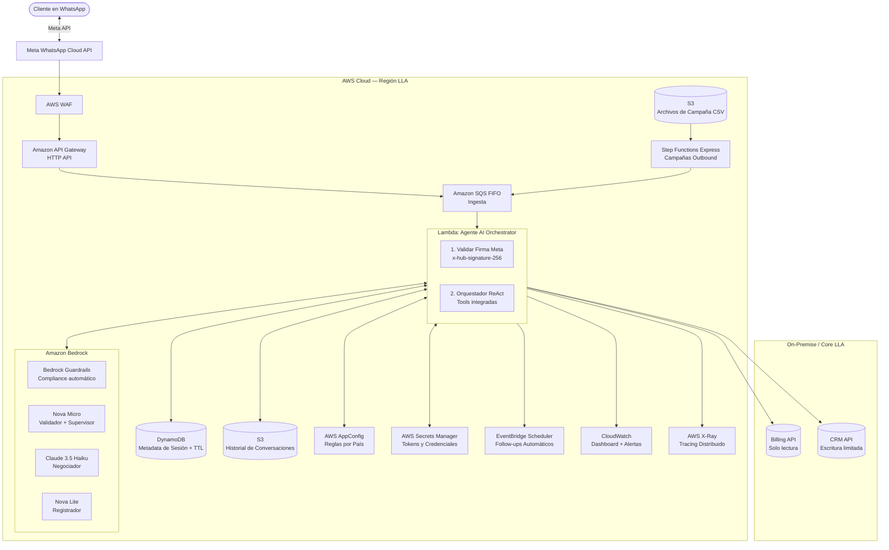

# Proyecto Ágil: Inteligencia Artificial al Servicio de la Gestión de Clientes

**Candidato**: Esteban (AI Developer)
**Fecha**: Junio 2026
**Objetivo**: Diseñar y construir un sistema de Agentes de IA para la gestión y cobranza de clientes a través de WhatsApp, utilizando infraestructura 100% en AWS.

---

## 0. Supuestos Declarados

El assessment indica explícitamente que los supuestos son parte de la evaluación. Estos son los supuestos de diseño tomados:

| Supuesto | Impacto en el diseño |
|---|---|
| LLA tiene una API interna de billing con endpoint REST | El Agent Lambda llama directamente a esta API. Si fuera batch/file, el patrón cambiaría a S3 + Glue |
| El CRM soporta escritura vía API REST o SDK | Requerido para registrar promesas sin intervención manual |
| Meta Business API está habilitada para el número de LLA | Prerequisito de negocio — requiere aprobación de Meta, proceso que puede tomar semanas |
| El volumen de morosos activos simultáneos es < 100,000 | SQS FIFO a 300 TPS maneja este volumen. Para >1M se evaluaría Kinesis Data Streams |
| Los clientes dieron consentimiento de contacto en su contrato de servicio | Permite el contacto outbound por WhatsApp sin opt-in adicional. Para no-clientes se requiere opt-in explícito |
| Latencia de Bedrock (Claude 3.5 Haiku) < 3s por invocación | Deja margen para lograr la meta de p95 < 5s incluyendo tools |
| Las reglas de negocio por país cambian semanalmente, no por segundo | Justifica AppConfig con caché de 60s en lugar de lecturas en caliente a DynamoDB |
| Las APIs de Billing y CRM son accesibles desde la VPC de AWS (o vía PrivateLink) | Permite que el Agent Lambda las invoque directamente sin Tool Lambdas intermedias |

---

## 1. Diseño de Arquitectura AWS

La arquitectura ha sido diseñada con un enfoque **100% Serverless** para asegurar alta disponibilidad, absorber picos de tráfico (comunes en campañas de cobranza) y escalar dinámicamente a múltiples países — sin pagar por infraestructura inactiva.

### 1.1 Diagrama de Componentes



### 1.2 Justificación de Decisiones Tecnológicas

#### Ingesta y Desacoplamiento

**Amazon API Gateway HTTP API** (no REST API)
La API de WhatsApp envía webhooks que deben responderse con HTTP 200 en menos de 5 segundos o Meta asume fallo y reintenta. HTTP API cubre completamente este caso y cuesta **70% menos** que REST API ($1.00 vs $3.50 por millón de requests). REST API tiene características avanzadas (caching, usage plans, request validation) que no se necesitan para un webhook receiver.

**Amazon SQS FIFO — Ingesta**
Desacopla la recepción del procesamiento: el HTTP 200 va a Meta en milisegundos, mientras el LLM toma 2-5 segundos. FIFO garantiza que los mensajes de un mismo cliente se procesen en orden cronológico (`MessageGroupId = NumeroTelefono`), evitando race conditions cuando un cliente envía dos mensajes en rápida sucesión. A 300 TPS de capacidad, maneja cómodamente el volumen de LLA.

**Sin Lambda Authorizer**
La validación de la firma de Meta (`x-hub-signature-256`) se realiza *dentro* del Agent Lambda, después de leer de SQS — no como un Authorizer separado. Esto elimina un hop de red y un posible cold start adicional en el path crítico. Si la firma es inválida, el mensaje se descarta sin procesar; Meta no lo sabe porque ya recibió su HTTP 200.

#### Procesamiento y IA

**AWS Lambda — Agent Orchestrator**
Escala de cero a miles de instancias instantáneamente. Cada invocación procesa exactamente un turno de conversación (no toda la sesión), manteniéndose bien dentro del límite de 15 minutos. Las tools (consultar saldo, registrar acuerdo) se ejecutan como llamadas directas a las APIs de Billing y CRM desde dentro del mismo Lambda — sin Tool Lambdas intermedias, eliminando 200-500ms de latencia por herramienta invocada.

**Amazon Bedrock — Multi-modelo por agente**
Bedrock permite consumir múltiples modelos de forma privada — ningún dato de cliente de LLA es usado para entrenar modelos públicos. La clave es seleccionar el modelo correcto para cada tarea:

| Agente | Tarea | Modelo | Razón |
|---|---|---|---|
| Validador | Detectar "sí / no / no soy el titular" | Amazon Nova Micro | Tarea simple de clasificación. 10x más barato que Haiku |
| Negociador | Razonamiento multi-paso, persuasión, cálculo de fechas | Claude 3.5 Haiku | Requiere la mayor capacidad. Balance óptimo costo/calidad |
| Registrador | Extraer teléfono + monto + fecha del historial | Amazon Nova Lite | Extracción estructurada. 5x más barato que Haiku |
| Supervisor | Decisión binaria: APROBADO / RECHAZADO | Bedrock Guardrails | No es un LLM call — es un filtro nativo integrado en la invocación |

**Bedrock Guardrails — Reemplaza al Supervisor LLM**
En lugar de una segunda invocación LLM completa para auditar cada respuesta, Bedrock Guardrails aplica filtros configurables *dentro* de la misma llamada al modelo: denied topics ("no prometer condonación total de deuda"), word filters (lenguaje amenazante), PII detection (no exponer datos de otros clientes) y grounding checks. Costo: $0.15 por 1,000 unidades de texto — órdenes de magnitud más barato que un LLM call completo. Si Guardrails bloquea una respuesta, se envía automáticamente un mensaje de fallback configurado.

#### Estado y Memoria

**Amazon DynamoDB — Metadata de Sesión (con TTL)**
Almacenamiento de baja latencia para el *estado* de la conversación: número de teléfono, fase actual (VALIDADOR/NEGOCIADOR/REGISTRADOR/CERRAR), timestamp de última interacción, y la clave S3 del historial. TTL de 48 horas para auto-expirar sesiones cerradas sin costo manual. Partition key: `COUNTRY_ID#PHONE_NUMBER` para escalabilidad multi-país.

**Amazon S3 — Historial de Conversaciones**
El historial completo de mensajes (incluyendo tool results) se almacena en S3, no en DynamoDB. DynamoDB tiene un límite de 400KB por item — una conversación larga con múltiples tool calls puede superarlo. S3 no tiene ese límite, cuesta ~3x menos por GB de almacenamiento, y el historial queda disponible para análisis con Athena. Estructura de keys: `conversations/PA/+50712345678/2026-06-22.json`. S3 Lifecycle Policy: mover a Glacier después de 90 días para auditoría regulatoria.

#### Configuración y Seguridad

**AWS AppConfig — Reglas por País**
Permite que el equipo comercial modifique reglas de negocio (montos mínimos de negociación, tonos de comunicación, límites de cuotas por país) sin redesplegar código. El SDK de AppConfig cachea la configuración en memoria del Lambda con TTL configurable (60-300s), minimizando las llamadas a la API y su costo. Ventaja sobre SSM Parameter Store: soporta deployment strategies (canary rollout) y rollback automático si una nueva configuración rompe métricas.

**AWS Secrets Manager**
Almacena de forma segura los tokens de la Meta API, credenciales del CRM y claves de las APIs de Billing. Rotación automática configurable. Costo de $0.40/secret/mes es negligible frente al riesgo de exponer credenciales.

**IAM Least Privilege — Sin Tool Lambdas**
El Agent Lambda tiene un execution role con políticas granulares:
- `billing:Read` — solo GET a endpoints específicos del Billing API
- `crm:WritePromise`, `crm:WriteEscalation` — solo los endpoints necesarios del CRM
- `dynamodb:GetItem`, `dynamodb:PutItem` — solo la tabla de sesiones
- `s3:GetObject`, `s3:PutObject` — solo el bucket de conversaciones

#### Campaña Outbound y Follow-ups

**S3 + Step Functions Express — Campañas**
El área de cobranza carga un CSV de morosos a S3, lo que dispara un Step Functions Express Workflow que: lee el archivo, segmenta por país y nivel de deuda, y escribe mensajes iniciales en SQS con rate limiting para no superar los límites de Meta. Express Workflows cuestan $1.00/millón de transiciones — 40x más barato que Standard Workflows, y están diseñados para exactamente este patrón de alta frecuencia y corta duración.

**EventBridge Scheduler — Follow-ups Inteligentes**
Cuando el agente envía un mensaje esperando respuesta, programa un evento para X horas después. Al dispararse, una Lambda verifica en DynamoDB si el cliente respondió. Si no, reactiva el agente con el historial completo y una instrucción de re-acercamiento. Costo: $1.00/millón de invocaciones — prácticamente gratis para el volumen de LLA.

#### Observabilidad

**CloudWatch + X-Ray**
Las Lambdas emiten métricas custom a CloudWatch: duración de invocación de Bedrock, resultado del Guardrail (aprobado/rechazado), fase de conversación alcanzada. X-Ray provee tracing distribuido para identificar cuellos de botella en el path Lambda → Bedrock → API externa. Dashboard central con las métricas de negocio y técnicas.

---

## 2. Estrategia y Reglas de Negocio

### ¿Cómo llega el agente a saber con quién hablar y qué decirle?

El agente es "despertado" de dos maneras:

1. **Inbound (Recepción)**: El cliente escribe por WhatsApp. El sistema identifica su número, consulta DynamoDB para ver si hay una sesión activa, recupera el historial de S3 (si existe), y llama al Billing API para obtener el estado de deuda actual.
2. **Outbound (Campaña)**: El área de cobranza carga un CSV de morosos a S3, lo que dispara Step Functions Express para inyectar los mensajes iniciales en SQS y abrir la conversación — con rate limiting para respetar los límites de Meta.

### ¿Cómo funciona el agente internamente?

El agente actúa como un orquestador siguiendo el patrón **ReAct** (Reason & Act):

1. Lee el mensaje y el historial completo de S3
2. Razona con Bedrock sobre la intención del cliente
3. Decide si invoca tools (Billing API, CRM API) directamente
4. Formula una respuesta empática y persuasiva
5. La respuesta pasa por Bedrock Guardrails antes de enviarse

**Arquitectura Multi-Agente Especializada:**

```
Mensaje entrante
      │
      ▼
[Agente 1: Validador — Nova Micro]
Confirma identidad del titular. Sin acceso a datos de deuda.
      │ (identidad confirmada)
      ▼
[Agente 2: Negociador — Claude 3.5 Haiku]
Escalada: pago total → 2 cuotas → 3 cuotas → promesa → canales alternativos
Tools directas: Billing API (lectura), CRM API (registro pago inmediato), EscalarHumano
      │ (acuerdo alcanzado)
      ▼
[Agente 3: Registrador — Nova Lite]
Extrae monto + fecha del historial y formaliza en CRM API
      │
      ▼
[Agente 4: Cierre — Nova Lite]
Confirma, celebra y cierra la sesión
      │
      ▼
[Bedrock Guardrails] ← Filtra TODA respuesta antes de enviarla al cliente.
Bloquea: condonación total, lenguaje amenazante, datos de terceros,
referencias legales sin base. Fallback configurable si bloquea.
```

**Segmentación de tono por riesgo:**
- **Bajo (≤15 días):** Tono suave. "Un pequeño recordatorio"
- **Medio (16–60 días):** Firme pero amable. "Es importante regularizarlo pronto"
- **Alto (>60 días):** Urgencia real. "Evitemos la suspensión del servicio"

### Re-acercamiento Inteligente (Follow-ups)

Cuando el agente envía una propuesta y el cliente no responde ("deja en visto"), EventBridge Scheduler programa una Lambda para X horas después. La Lambda verifica `LastInteractionTime` en DynamoDB. Si el cliente sigue sin responder, el agente se reactiva con el historial completo y una instrucción de insistencia contextual — no empieza desde cero, continúa la conversación con fluidez.

### ¿Cómo se integra con los sistemas existentes?

El Agent Lambda llama directamente a las APIs de LLA con roles IAM de mínimo privilegio:
- **Billing API**: Solo lectura. El agente puede ver el saldo pero nunca modificarlo.
- **CRM API**: Escritura limitada a endpoints específicos: registrar promesa de pago, abrir ticket de escalamiento.

El orquestador nunca tiene acceso directo a las bases de datos — siempre pasa por las APIs de negocio, que tienen su propia capa de validación.

### ¿Cómo se gestiona y controla el sistema?

- **Reglas de negocio**: El equipo comercial las modifica en AppConfig sin tocar código ni hacer deploys. Ejemplo: "En Panamá, si deuda > $200, ofrecer hasta 3 cuotas. En Jamaica, máximo 2 cuotas."
- **Campañas outbound**: El área de cobranza sube un CSV a S3. El sistema lo procesa automáticamente, controla el rate limiting y genera los primeros mensajes.
- **Guardrails**: El equipo de cumplimiento configura los filtros directamente en la consola de Bedrock, sin tocar el código del agente.

---

## 3. Riesgos, Mitigaciones y Métricas

### ¿Qué puede salir mal y cómo lo mitigamos?

| Riesgo | Probabilidad | Impacto | Mitigación |
|---|---|---|---|
| **Alucinación**: el agente promete un descuento no autorizado | Media | Alto | Bedrock Guardrails bloquea la respuesta. La operación de descuento solo existe en código de la Tool — el LLM no puede inventar montos |
| **Saturación humana**: escalamientos excesivos colapsan el call center | Media | Alto | AppConfig define un límite dinámico de escalamientos simultáneos. Si se supera, el agente ofrece contacto en 24h y abre ticket asíncrono |
| **Ataque / spam**: un bot envía miles de mensajes generando costos en Bedrock | Baja | Alto | WAF en la entrada + rate limit por número en DynamoDB (máx. N invocaciones de Bedrock por día por usuario) |
| **Latencia excesiva**: Bedrock tarda > 5s y el cliente ve al agente "tardando" | Baja | Medio | Indicador de "escribiendo..." via WhatsApp Typing Indicator. Circuit breaker en la Lambda con mensaje de fallback |
| **Conversación sin contexto**: Lambda nueva sin historial previo | Media | Medio | S3 siempre tiene el historial. La Lambda lo carga al inicio de cada invocación |
| **Error en API de Billing/CRM**: la herramienta falla | Baja | Medio | Try/catch con retry exponencial (2 intentos). Si falla, el agente informa al cliente y sugiere el portal web |
| **Cambio de reglas en AppConfig con error**: nueva configuración rompe el agente | Baja | Alto | AppConfig rollback automático si las métricas de CloudWatch superan umbrales configurados (canary deployment) |

### ¿Cómo sabemos si el sistema está funcionando? (Métricas)

**Métricas de Negocio** — para el dashboard del área comercial:

| Métrica | Definición | Meta inicial |
|---|---|---|
| **Tasa de Recuperación ($)** | Monto de deuda cobrada / monto total gestionado por el agente | > 30% en 30 días |
| **Resolución en Primer Contacto (FCR)** | Conversaciones que terminan en promesa sin intervención humana | > 60% |
| **Tasa de Escalamiento** | Conversaciones transferidas a humano / total | < 20% |
| **Tasa de Promesas Cumplidas** | Promesas registradas que se pagan en la fecha acordada | > 70% |
| **Tasa de Opt-out (STOP)** | Usuarios que solicitan no ser contactados | < 5% |

**Métricas Técnicas** — para el dashboard de operaciones:

| Métrica | Meta |
|---|---|
| **Latencia p95** (mensaje enviado → respuesta recibida) | < 5 segundos |
| **Latencia p99 de Bedrock** | < 8 segundos |
| **Tasa de errores Lambda** | < 0.1% |
| **Tasa de bloqueo de Guardrails** | Alerta si > 5% (indica prompt drift o ataque) |
| **Mensajes en DLQ (Dead Letter Queue)** | Alerta si > 0 en 5 minutos |

---

## 4. Estimación de Costos

### Escenario: 10,000 conversaciones activas por mes

Supuestos: 5 turnos promedio por conversación, 3 invocaciones de Bedrock por turno (1 por agente), 1 tool call por turno.

| Servicio | Cálculo | Costo/mes |
|---|---|---|
| **SQS FIFO** | 50K mensajes × $0.50/millón | $0.03 |
| **API Gateway HTTP API** | 50K requests × $1.00/millón | $0.05 |
| **Lambda** (Agent Orchestrator) | 50K inv × 3s avg × 512MB → ~$0.80 | $0.80 |
| **Bedrock Nova Micro** | 150K inv (Validador) × ~$0.10/millón tokens | $0.60 |
| **Bedrock Claude 3.5 Haiku** | 50K inv (Negociador) × ~$0.80/millón tokens | $4.00 |
| **Bedrock Nova Lite** | 100K inv (Registrador + Cierre) × ~$0.20/millón tokens | $1.00 |
| **Bedrock Guardrails** | 50K respuestas × 500 tokens avg = 25M text units × $0.15/1000 | $3.75 |
| **DynamoDB** | 10K sesiones × 2KB metadata × on-demand | $0.50 |
| **S3** (historial + campañas) | 10K sesiones × 50KB avg + operaciones | $0.30 |
| **EventBridge Scheduler** | 10K follow-ups × $1.00/millón | $0.01 |
| **Secrets Manager** | 5 secrets × $0.40 | $2.00 |
| **CloudWatch + X-Ray** | Logs + traces estimados | $3.00 |
| **AWS WAF** | $5.00 base + $1.00/millón requests | $5.05 |
| **TOTAL ESTIMADO** | | **~$21/mes** |

### Escenario: 100,000 conversaciones activas por mes

Escalando linealmente (los costos fijos como WAF y Secrets Manager se amortiza):

| Componente | Costo/mes |
|---|---|
| Servicios de cómputo y mensajería | ~$85 |
| Bedrock (todos los modelos + Guardrails) | ~$95 |
| Almacenamiento y configuración | ~$15 |
| Observabilidad | ~$10 |
| **TOTAL ESTIMADO** | **~$205/mes** |

**Costo por conversación a escala: ~$0.002 USD** — menos de medio centavo por interacción completa con un cliente.

Para contexto: una llamada telefónica de cobranza de 5 minutos con un agente humano cuesta entre $2 y $5 USD en un call center de Panamá. El agente IA gestiona el mismo caso por $0.002 — **una reducción de 99.9% en costo por interacción**.

### Palancas de optimización si el costo crece

1. **Acortar el historial enviado a Bedrock**: Enviar solo los últimos 10 turnos en lugar del historial completo reduce tokens de entrada y costo.
2. **Cacheo de prompts con Bedrock Prompt Caching**: Si el system prompt es el mismo para todos los usuarios, AWS cachea los tokens de entrada y cobra 90% menos por ellos.
3. **Lambda SnapStart**: Para Lambdas en Java, elimina cold starts. En Python (stack actual), no aplica — pero provisioned concurrency durante horas pico de campaña reduce latencia.
4. **Spot instances para Step Functions**: Para el procesamiento de campañas en batch, no hay urgencia — se puede usar capacidad spot.
